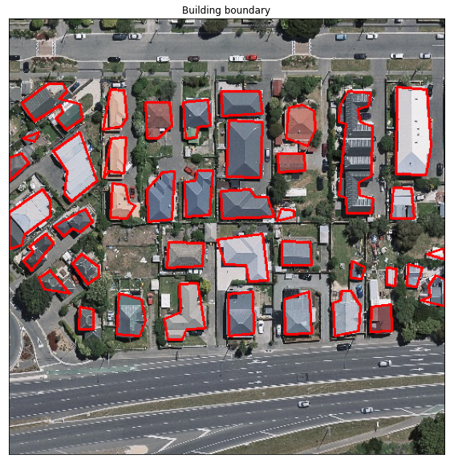

## How To Use
- Install docker https://docs.docker.com/engine/install/ (macos, Windows or Linux)
- Clone the Repository : ```git clone https://github.com/Youssef-Harby/Remote-sensing-building-extraction-to-3D-model-using-Paddle-and-Grasshopper.git```
- Go to project directory " ```cd Remote-sensing-building-extraction-to-3D-model-using-Paddle-and-Grasshopper```
- download or make your own dataset : https://aistudio.baidu.com/aistudio/datasetdetail/69911
- Make sure you copied the dataset and the folders should be like that.
  
  

- Build the docke image : ```docker compose up --build ```
- go to http://127.0.0.1:8888/
- you will find your token in the cli of the image.
  
  

## Code In Detail ⬇️

# Remote sensing building extraction to 3D model using Paddle and Grasshopper

The domestic deep learning platform PaddlePaddle plus the visual
programming language Grasshopper (based on the Rhino platform), how to
quickly generate building models from remote sensing images? Wait and
see\~ \~

*【It can be regarded of the previous
project [Rhino(Grasshopper)+PaddleX快速建模](https://aistudio.baidu.com/aistudio/projectdetail/1311631) as
a detailed sorting , using a new data set and post-processing method
(simplified boundary), canceling the building height prediction
(inaccurate) and changing it to random Height (big guy can also be
changed to calculate the height according to the shadow of the
building)\] 】*

# One, model training

Model training uses PaddleSeg suite, PaddleSeg is an end-to-end image
segmentation development suite developed based on flying paddle
PaddlePaddle, covering a large number of high-quality segmentation
models in different directions such as high-precision and lightweight.
Through the modular design, two application methods are provided, such
as configuration drive and API call, to help developers more
conveniently complete the entire image segmentation application from
training to deployment

-   model：Unet++
-   dataset：Aerial imagery dataset

## 1. #Install dependencies/decompress data sets

-   You need to pip paddleseg before each run
-   The data set does not need to be decompressed repeatedly. The
    original aerial imagery data of the Aerial imagery dataset comes
    from the New Zealand Land Information Service website. This aerial
    imagery (including 187,000 buildings) is down-sampled to a ground
    resolution of 0.3m and cropped into 8189 tiles of 512×512 pixels.
    The original training set, validation set and test set are merged
    here (the original data comes from the Photogrammetry and Computer
    Vision Group (GPCV) of Wuhan University-Ji Shunping. Introduction to
    Intelligent Photogrammetry \[M\], Science Press, 2018. 4 moon.

``` {.python}
! pip install paddleseg # Already installed in docker (requirements.txt)
! unzip -q /home/aistudio/data/data69911/BuildData.zip -d DataSet
```


## 2. #Generate data list

Generate training set and test set according to 9:1, after the data list
is generated, there is no need to run this module repeatedly

``` {.python}
import os
import random
from PIL import Image
import matplotlib.pyplot as plt

def create_list(data_path):
    image_path = os.path.join(data_path, 'image')
    label_path = os.path.join(data_path, 'label')
    data_names = os.listdir(image_path)
    random.shuffle(data_names)  # Scramble data
    with open(os.path.join(data_path, 'train_list.txt'), 'w') as tf:
        with open(os.path.join(data_path, 'val_list.txt'), 'w') as vf:
            for idx, data_name in enumerate(data_names):
                img = os.path.join('image', data_name)
                lab = os.path.join('label', data_name.replace('jpg', 'png'))
                if idx % 9 == 0:  # 90% as the training set
                    vf.write(img + ' ' + lab + '\n')
                else:
                    tf.write(img + ' ' + lab + '\n')
    print('Data list generation completed')

data_path = 'DataSet'
# create_list(data_path)  # Generate data list

# View a set of data
vis_img = Image.open('DataSet/image/0045.jpg')
vis_lab = Image.open('DataSet/label/0045.png')
plt.figure(figsize=(10, 20))
plt.subplot(121);plt.imshow(vis_img);plt.xticks([]);plt.yticks([]);plt.title('Image')
plt.subplot(122);plt.imshow(vis_lab);plt.xticks([]);plt.yticks([]);plt.title('Label')
plt.show()
```


## #3. Train the network
Using the Unet++ network provided by PaddleSeg, the author of this
network [知乎](https://zhuanlan.zhihu.com/p/44958351) the design concept
of Unet++ very clearly. Compared with the original Unet network, in
order to avoid the fusion of the semantically dissimilar features of
pure jump connections in UNet, UNet++ further strengthens these
connections by introducing nested and dense jump connections, with the
purpose of reducing encoders and decoding Semantic gap

:::

``` {.python}
import paddle
from paddleseg.models import UNetPlusPlus
import paddleseg.transforms as T
from paddleseg.datasets import Dataset
from paddleseg.models.losses import BCELoss
from paddleseg.core import train

def train_model(base_lr=0.00001, iters=10000, batch_size=8, model_path=None):
    # Network definition
    model = UNetPlusPlus(in_channels=3, num_classes=2, use_deconv=True)
    if model_path is not None:
        para_state_dict = paddle.load(model_path)
        model.set_dict(para_state_dict)
    # Build the training set
    train_transforms = [
        T.RandomHorizontalFlip(),
        T.RandomVerticalFlip(),
        T.RandomRotation(),
        T.RandomScaleAspect(),
        T.RandomDistort(),
        T.Resize(target_size=(512, 512)),
        T.Normalize()
    ]
    train_dataset = Dataset(
        transforms=train_transforms,
        dataset_root='DataSet',
        num_classes=2,
        mode='train',
        train_path='DataSet/train_list.txt',
        separator=' ',
    )
    # Build validation set
    val_transforms = [
        T.Resize(target_size=(512, 512)),
        T.Normalize()
    ]
    val_dataset = Dataset(
        transforms=val_transforms,
        dataset_root='DataSet',
        num_classes=2,
        mode='val',
        val_path='DataSet/val_list.txt',
        separator=' ',
    )
    # parameter settings
    lr = paddle.optimizer.lr.CosineAnnealingDecay(base_lr, T_max=2000, last_epoch=0.5)
    optimizer = paddle.optimizer.Adam(lr, parameters=model.parameters())
    losses = {}
    losses['types'] = [BCELoss()]
    losses['coef'] = [1]
    # train
    train(
        model=model,
        train_dataset=train_dataset,
        val_dataset=val_dataset,
        optimizer=optimizer,
        save_dir='output',
        iters=iters,
        batch_size=batch_size,
        save_interval=int(iters/5),
        log_iters=10,
        num_workers=0,
        losses=losses,
        use_vdl=True)

# train_model(iters=1000, model_path='output/model_kp0.9085/model.pdparams')
```

## #4. Evaluation

You can see that the evaluation result of the best model is not bad

    [EVAL] #Images=910 mIoU=0.9143 Acc=0.9773 Kappa=0.9085 
    [EVAL] Class IoU: [0.8549 0.9738]
    [EVAL] Class Acc: [0.935  0.9843]

``` {.python}
import paddle
from paddleseg.models import UNetPlusPlus
import paddleseg.transforms as T
from paddleseg.datasets import Dataset
from paddleseg.core import evaluate

def eval_model(model_path=None):
    # Network definition
    model = UNetPlusPlus(in_channels=3, num_classes=2, use_deconv=True)
    if model_path is not None:
        para_state_dict = paddle.load(model_path)
        model.set_dict(para_state_dict)
    # Build validation set
    val_transforms = [
        T.Resize(target_size=(512, 512)),
        T.Normalize()
    ]
    val_dataset = Dataset(
        transforms=val_transforms,
        dataset_root='DataSet',
        num_classes=2,
        mode='val',
        val_path='DataSet/val_list.txt',
        separator=' ',
    )
    evaluate(
        model,
        val_dataset
    )

eval_model(model_path='output/model_kp0.9085/model.pdparams')
```
:::

``` {.python}
import numpy as np
import paddle
from PIL import Image
from paddleseg.models import UNetPlusPlus
import paddleseg.transforms as T
from paddleseg.core import infer
import matplotlib.pyplot as plt

def nn_infer(img_path, lab_path, model_path='output/model_kp0.9085/model.pdparams', show=True):
    # Network definition
    model = UNetPlusPlus(in_channels=3, num_classes=2, use_deconv=True)
    if model_path is not None:
        para_state_dict = paddle.load(model_path)
        model.set_dict(para_state_dict)
    # forecast result
    transforms = T.Compose([
        T.Resize(target_size=(512, 512)),
        T.Normalize()
    ])
    img, lab = transforms(img_path, lab_path)
    img = paddle.to_tensor(img[np.newaxis, :])
    pre = infer.inference(model, img)
    pred = paddle.argmax(pre, axis=1).numpy().reshape((512, 512))
    if show:
        plt.figure(figsize=(15, 45))
        plt.subplot(131);plt.imshow(Image.open(img_path));plt.xticks([]);plt.yticks([]);plt.title('Image')
        plt.subplot(132);plt.imshow(lab.astype('uint8'));plt.xticks([]);plt.yticks([]);plt.title('Label')
        plt.subplot(133);plt.imshow(pred.astype('uint8'));plt.xticks([]);plt.yticks([]);plt.title('Prediction')
        plt.show()
    return pred.astype('uint8')

name = '5255'
img_path = 'DataSet/image//' + name + '.jpg'
lab_path = 'DataSet/label//' + name + '.png'
_ = nn_infer(img_path, lab_path)
```


## #5. The network\'s outcome prediction

Take the 5255 group of images as an example to view the predicted
results


## 6. #Opencv post-processing (\*adaptive modeling)

It is not enough to just get the segmentation results here. In order to
model fewer faces and simple shapes, the following operations can or
need to be performed:

-   Perform opening operations and remove small connections
-   Calculate the connected area, delete the connected area less than a
    certain threshold
-   Fit the boundary to simplify the shape

``` {.python}
import cv2

def build_extracter(
    img_path,
    model_path='output/model_kp0.9085/model.pdparams',
    threshold_area=200,  # Remove the small threshold of the Unicom area
    threshold_area_simplify=5,  # Boundary simplification factor
    open_comput=False,  # Whether to open
    open_kernel_size=9,  # Core size for open operation
    show=True
    ):
    cv_img = nn_infer(img_path, lab_path, model_path, show=False)
    cv_img = np.uint8(~(cv_img.astype(bool)))
    # 开运算
    if open_comput:
        kernel = cv2.getStructuringElement(cv2.MORPH_ELLIPSE, (open_kernel_size, open_kernel_size))
        cv_img = cv2.morphologyEx(cv_img, cv2.MORPH_OPEN, kernel)
    contours, _ = cv2.findContours(cv_img, cv2.RETR_LIST, cv2.CHAIN_APPROX_SIMPLE)
    bods = []
    for contour in contours:
        area = cv2.contourArea(contour)
        if area > threshold_area:  # Screen the small connecting area
            out = cv2.approxPolyDP(contour, threshold_area_simplify, True)  # 简化形状
            bods.append(out)
    if show:
        img = cv2.cvtColor(cv2.imread(img_path), cv2.COLOR_BGR2RGB)
        cimg = cv2.drawContours(img, bods, -1, (255, 0, 0), 2)
        plt.figure(figsize=(10, 10))
        plt.title('Building boundary')
        plt.imshow(cimg);plt.xticks([]);plt.yticks([])
        plt.show()
    return bods

conts = build_extracter(img_path)
```



## 7. #Export prediction model

Use paddle.jit.save to save the model as a predictive model

``` {.python}
import paddle
from paddle.static import InputSpec
from paddleseg.models import UNetPlusPlus

def output_inf_model(params_path, save_path):
    model = UNetPlusPlus(in_channels=3, num_classes=2, use_deconv=True)
    para_state_dict = paddle.load(params_path)
    model.set_dict(para_state_dict)
    paddle.jit.save(model, save_path, [InputSpec([None, 3, 512, 512], 'float32')])

params_path = 'output/model_kp0.9085/model.pdparams'
save_path = "output_inf/UnetPP"
# output_inf_model(params_path, save_path)
```

## 8. #Test load prediction model

Use paddle.jit.load to load the model in to ensure that the exported
prediction model can be used normally

``` {.python}
import paddle
import paddleseg.transforms as T
import numpy as np
import matplotlib.pyplot as plt

save_path = "output_inf/UnetPP"
img_path = 'DataSet/image/5255.jpg'
inf_model = paddle.jit.load(save_path)
inf_model.eval()
transforms = T.Compose([
    T.Resize(target_size=(512, 512)),
    T.Normalize()
])
img, _ = transforms(img_path)
img = paddle.to_tensor(img[np.newaxis, :])
pre = inf_model(img)
pred = paddle.argmax(pre, axis=1).numpy().reshape((512, 512))
plt.figure(figsize=(10, 10))
plt.imshow(pred.astype('uint8'));plt.title('Inf Result');plt.xticks([]);plt.yticks([])
plt.show()
```

    /usr/local/lib/python3.8/site-packages/paddle/fluid/backward.py:1697: DeprecationWarning: Using or importing the ABCs from 'collections' instead of from 'collections.abc' is deprecated since Python 3.3, and in 3.10 it will stop working
      return list(x) if isinstance(x, collections.Sequence) else [x]


# Two, Grasshopper model deployment

The above operations in AI Studio have been completed, and the following
operations cannot be run, and will be described using Markdown. Need to
operate locally on the computer with Rhino (with Grasshopper)

## #1. Export the model to local

Select in the left folder`output_inf`，Click the download icon on the
right to download the prediction model to a local task folder. Unzip and
copy the files inside to the outer layer (AI Studio downloads will have
the path home\\aistudio by default)

## #2. Create a python environment

Use conda to create a new virtual environment, you need pip on numpy,
paddlepaddle, paddleseg, opencv, (whatever) named pdseg

    conda create -n pdseg python=3.7
    pip install paddlepaddle/paddleseg/opencv-python……

# #3. Configure the grasshopper environment

Grasshopper (GH for short) is a visual programming language that runs on
the Rhino platform. It is one of the mainstream software in the
direction of digital design, and it also overlaps with interactive
design. Compared with traditional design methods, GH has two biggest
features: one is that the computer can automatically generate results
according to the proposed algorithm by inputting instructions. The
algorithm results are not limited to models, video streaming media, and
visualization solutions. The second is that by writing algorithm
programs, mechanical repetitive operations and a large number of logical
evolution processes can be replaced by computer cyclic operations, and
program adjustments can also directly obtain modified results through
parameter modifications. These methods can effectively improve the work
of designers. efficient

-   You need to download ghcpython. Grasshopper comes with python as
    ipython based on .net. To do deep learning predictions, you need to
    use native python, which can be satisfied by ghcpython
-   Drag in the ghcpython battery, select Python-\>Choose Interpreter in
    the menu bar, and set the python to be used in the pdseg environment
    in the virtual environment (the environment configured in the second
    step).

## #4. Write the code and connect the battery

As shown in the figure, the logic is relatively clear, namely

1.  First read the image and move it to the appropriate position
2.  Use predictive models for image segmentation to extract buildings
3.  Use opencv for post-processing, and change the data into a list of
    coordinate points such as \[xy\], which is convenient for
    Grasshopper to convert into its own point and line data
4.  Use the built-in python to convert into a data type that can be
    modeled
5.  Connect the border and pull out a certain height
6.  Capped

-   ps：The display here uses the TopMostViewport for Rhino floating
    window top plug-in
-   `.gh`The file has been placed in the folder


## #5. Animation effect

At most 1M is really tired, showing the effect of changing the
minimum/maximum storeys, storey heights and boundary simplification
parameters of the building\~


# about 

| Name | Chen Yizhou |
| -------- | -------- |
| School/Professional | Surveying and Mapping Science and Technology, Chongqing Jiaotong University |
| Home page | https://aistudio.baidu.com/aistudio/personalcenter/thirdview/1945 |

I hope to communicate more with everyone, especially the remote sensing students.